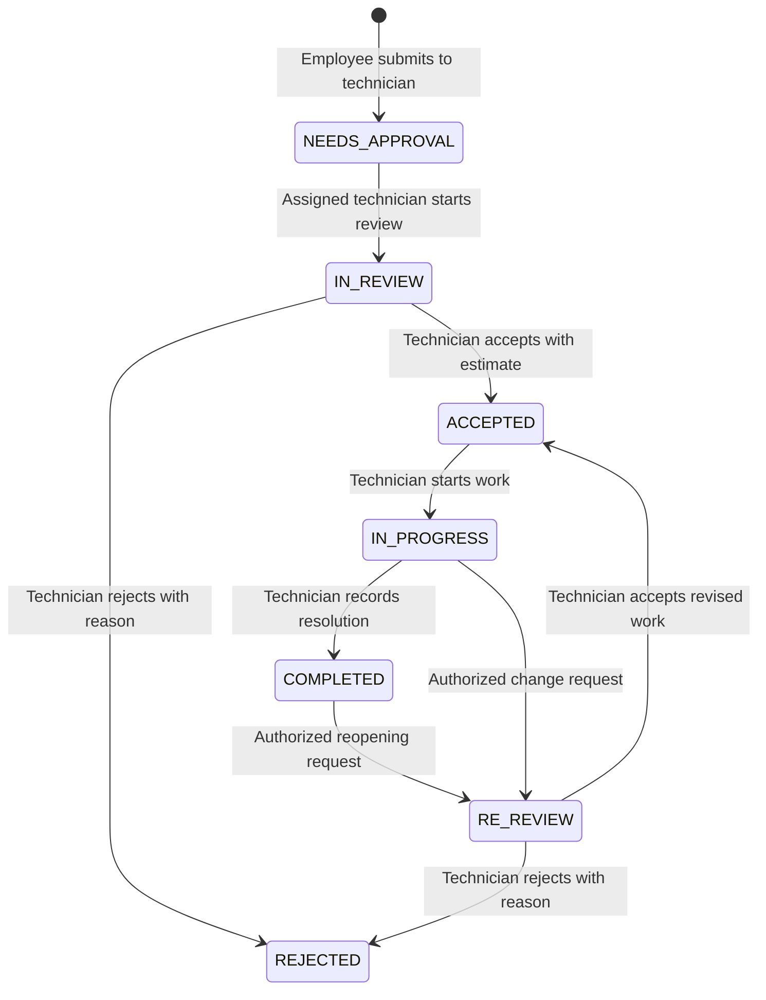

# Ticket-raising-system review

Reviewed 8 September 2026, including the uncommitted Projects feature. This is a review and repair plan; application source and database records were not changed.

The application builds and has substantial working functionality, but it is not ready for deployment with real organizational data. The first repairs should address authorization and password-hash exposure, followed by workflow consistency, data integrity, and inaccurate reporting.

## Requirements confirmed during this review

- Employees select a technician, and that technician reviews the ticket directly. Admin approval is not a mandatory intermediate step. Direct assignment at creation is therefore intentional, not a defect.
- Projects and knowledge-base content require restricted access. Being signed in alone is insufficient.
- The precise article audience model, permissions of ordinary project members, and rejection/reopening rules still need decisions. Recommendations below identify these as decisions rather than existing requirements.

The requested `grill-me` file contains only `Call the Skill tool with "grilling".` That tool/skill was unavailable, so this review used direct source inspection, local framework documentation, isolated behavioral checks, and local HTTP checks.

## Evidence and limits

| Check | Result |
|---|---|
| Production `npm run build` | Passed compilation, TypeScript, and page generation. Both debug routes are included in the production route list. |
| Earlier standalone TypeScript check | Passed `npx tsc --noEmit --incremental false`. |
| Source ESLint | Failed: **40 errors, 26 warnings**, using `node node_modules/eslint/bin/eslint.js src`. These are source-only counts. |
| Isolated API/auth/SLA checks | 17 behavioral checks confirmed the expected good behavior or reproduced the reported defect, with database and push functions mocked. |
| Isolated component checks | 6 checks confirmed internal-note filtering, sensitive client props, limited dashboard totals, workflow actions, unsupported statuses, and technician-name aggregation. |
| Anonymous local HTTP checks | Login/register 200; dashboard 307 to login; users/projects/notifications APIs 401; KB API 200; debug API 200. |
| Live debug response | Five staff records returned; password fields present. No hashes or personal details were printed in the review output. |
| Live KB response | Public 200 with an empty article array. Unauthorized access is confirmed; no existing article contents were exposed in this test. |

The temporary local production server was stopped afterward. Full authenticated browser journeys, real push delivery, real concurrent database writes, migration deployment, and mobile visual rendering were not exercised. The isolated checks do not establish database integration or browser correctness. The local Next.js route-handler and authentication guides were consulted.

## What is implemented correctly

“Implemented” below means the normal code path is present and coherent; it is not a claim that all edge cases passed live testing.

| Area | Working foundation | Evidence / qualification |
|---|---|---|
| Build and routing | Current Next.js project compiles; dynamic route parameters are awaited. | Production build passed. |
| Credentials | Registration hashes passwords; login compares hashes; NextAuth issues JWT sessions. | [auth](src/lib/auth.ts), [registration](src/app/api/register/route.ts). Privilege assignment and session revocation remain defective. |
| Basic login boundary | Dashboard redirects anonymous users; multiple APIs return 401. | Confirmed by local HTTP. |
| Ticket creation | Title, description, priority, department, optional technician, screenshots, and creation timeline are persisted through a nested create. | [creation API](src/app/api/tickets/route.ts). API call shape checked with mocks. |
| Technician workflow | Assigned technician gets review, accept/reject, start-work, complete, and re-review actions. | [workflow](src/app/(dashboard)/tickets/[id]/WorkflowButtons.tsx). Action rendering checked in isolation. |
| Ticket visibility | Employee ticket list/detail limits access to the creator; technicians can view their own/assigned tickets and unassigned tickets through dashboard/detail. | Page-level checks exist; mutation APIs do not apply them. |
| Ticket filtering | List and export combine role restrictions with search/status/priority/department filters using AND. | [list](src/app/(dashboard)/tickets/page.tsx), [export](src/app/api/export-csv/route.ts). Valid filter values only. |
| Internal-note display | Employee detail page removes internal notes before passing comments to the client. | Confirmed in isolated component check. |
| Notifications | Reads and mark-read writes are constrained by current user ID. | Confirmed in isolated checks; anonymous GET rejected live. |
| Profile password change | Wrong current password is rejected; update response selects safe fields. | [profile API](src/app/api/profile/route.ts); rejection checked in isolation. |
| User deletion guard | Only admins can delete; self-deletion is rejected. | Isolated checks. Retention effects remain unsafe. |
| KB editing | Staff creation and author/admin edit/delete checks are present. | [KB API](src/app/api/kb/route.ts), [article API](src/app/api/kb/[id]/route.ts). Read restrictions are missing. |
| Projects | Creation, listing, detail queries, owner/member relations, and owner/admin deletion guard exist. | Integration remains incomplete; read/edit authorization is missing. |
| Push transport | Subscription persistence, service worker, sending, and expired-subscription cleanup exist. | Code inspection only; actual push delivery untested. |

## Findings and repairs

Priority meanings: **Critical** = direct privilege or credential exposure; **High** = unauthorized access, important data loss, or serious integrity risk; **Medium** = incorrect/incomplete functionality; **Low** = usability or maintenance improvement.

### Access control and account lifecycle

**1. Critical — Public registration accepts privileged roles.**

The request body controls `role`, including `ADMIN`; the UI also openly offers TECH registration. An anonymous caller can become staff or administrator. Confirmed against the actual handler with a mocked database. [Source](src/app/api/register/route.ts:35).

**Fix:** Public signup must assign EMPLOYEE on the server. Add an authenticated admin-controlled staff invitation/provisioning path. Removing the UI selector alone does not fix the API.

**2. Critical — Production debug endpoint exposes staff password hashes.**

`GET /api/debug` fetches entire staff records without a session check. This was reproduced over local HTTP and the route is included in the production build. `/api/debug2` also returns exception messages and stack traces on failures. [Debug](src/app/api/debug/route.ts:4), [debug2](src/app/api/debug2/route.ts:8).

**Fix:** Remove public debug handlers. Diagnostics should not return complete user models or internal exceptions. If these routes have been publicly deployed, assess exposure and reset affected credentials/revoke sessions as appropriate; this review does not establish external exploitation.

**3. Critical — Comment author records cross the server/client boundary with passwords.**

The detail query includes `author: true`; `visibleComments` then becomes a prop to a client component. An isolated component check confirmed the password field remains in those props. Internal-note filtering does not remove sensitive author fields. [Query](src/app/(dashboard)/tickets/[id]/page.tsx:34), [prop boundary](src/app/(dashboard)/tickets/[id]/page.tsx:149).

**Fix:** Select only author ID/name and any genuinely displayed role. Establish explicit safe response shapes for user data. Fetching a full user exclusively inside a server component is not automatically a browser leak; passing that object to a client component is the issue here.

**4. High — Ticket mutations only check login, not permission.**

An unrelated employee can update a known ticket ID, overwrite its assignee, or create an internal note. Isolated checks reproduced all three. The update response can also disclose the ticket's scalar details. [Status](src/app/api/tickets/[id]/status/route.ts:61), [assign](src/app/api/tickets/[id]/assign/route.ts:19), [comments](src/app/api/tickets/[id]/comments/route.ts:25).

**Fix:** Centralize ticket access and action permissions. Validate the actor's relation to the ticket and staff status before mutation. Enforce staff-only internal notes. Reuse the same rules in pages, APIs, export, project-ticket queries, and notifications.

**5. High — Projects violate the confirmed restricted-access requirement.**

All signed-in users can list/read all projects. Any signed-in nonmember can PATCH fields and replace members; the query fetches members but never checks them. Detail GET includes tickets without ticket visibility filtering. [Project API](src/app/api/projects/[id]/route.ts:15), [PATCH](src/app/api/projects/[id]/route.ts:52), [list](src/app/api/projects/route.ts:14).

**Fix:** Allow reads only to owners, members, and authorized admins. Define which members may change status versus metadata/membership. Apply equivalent checks to server-rendered pages and metadata. Decide whether project membership grants access to its tickets; do not accidentally expose tickets through an include.

**6. High — Knowledge-base reads have no audience model.**

The listing API is anonymous; signed-in search and page queries do not filter an audience. `Article` has no visibility, project, or allowed-reader relation. Existing author/admin write checks do not restrict reading. [Listing](src/app/api/kb/route.ts:6), [search](src/app/api/kb/search/route.ts), [schema](prisma/schema.prisma:133).

**Fix:** Define staff-only and/or project-member article audiences, store the scope, and enforce it in list, detail, search suggestions, edit loading, and direct URLs. Adding a login check alone does not satisfy your requirement. Default previously unclassified articles to a restricted audience until classified.

**7. High — Deleted users and old privileges remain valid in JWT sessions.**

The JWT callback preserves user ID and role after login without checking current account state. Protected operations then trust the token. Deleting an admin does not inherently invalidate their existing token; a password change also leaves other sessions valid. [Auth callbacks](src/lib/auth.ts:47).

**Fix:** Verify an active account for sensitive operations and introduce session-version/revocation support. Update that version on deactivation, password reset, or privilege changes. Never take updated roles from client-submitted session data.

**8. High — Deleting a user can erase ticket and knowledge history.**

Deleting a creator cascades to their tickets, then comments, images, timeline, and notifications. Author deletion also cascades comments and articles. A project owner instead has a restrictive relation and can fail deletion. The UI only warns about deleting the user, not all this content. [Relations](prisma/schema.prisma:35), [delete handler](src/app/api/users/[id]/route.ts:69).

**Fix:** Prefer account deactivation with historical authorship retained. Specify retention explicitly, reassign project ownership where necessary, and reserve destructive deletion for an intentional workflow with an impact preview. Test with a disposable database.

**9. Medium — Authentication is missing account-abuse and recovery controls.**

There is no application-level login/signup rate limiter, normalized email policy, meaningful server password policy, verified invitation/email flow, or forgotten-password recovery. Login reveals whether the user exists through different error strings. [Auth](src/lib/auth.ts:21), [signup](src/app/api/register/route.ts).

**Fix:** Define normalized identity handling before migration, validate credentials server-side, rate-limit credential attempts, use a generic login failure, and add a secure recovery/provisioning flow. These are production gaps, not a claim that hash comparison is broken.

### Workflow and data correctness

**10. High — Status transitions and ticket claiming are not concurrency-safe.**

The status handler accepts any database enum state regardless of current state. Claiming updates by ID only, so two technicians can both claim and the last write wins. A stale tab can overwrite a newer status. [Status](src/app/api/tickets/[id]/status/route.ts:46), [claim](src/app/api/tickets/[id]/assign/route.ts:19).

**Fix:** Use an explicit transition table keyed by actor/current state/action, and a transaction with an expected status/version condition. Claim only where `assigneeId` is null; return 409 when another actor wins. Validate required reasons and estimates on the server.

**11. Medium — Old workflow concepts remain wired into the current workflow.**

`APPROVED` and `IN_TESTING` exist in the database enum but have no assignee actions or normal UI transitions. `requestedAssigneeId` and Forward to Tech remain, although creation deliberately writes direct `assigneeId`. REJECTED has no recovery action. Isolated rendering checks confirmed the actionless statuses. [Workflow](src/app/(dashboard)/tickets/[id]/WorkflowButtons.tsx), [creation](src/app/api/tickets/route.ts:32), [enum](prisma/schema.prisma:93).

**Fix:** Keep your direct-technician review path. Remove/migrate unused statuses and forwarding fields, or implement them intentionally. Decide if rejection is terminal or permits creator edits/reopening. Do not silently reintroduce admin approval. Rename the admin button “Accept & Resolve” because it sets ACCEPTED, not COMPLETED.

**12. High — Multi-step writes can save data and still report failure.**

Ticket creation commits before notification insertion. If notification insertion fails, the API returns 500 although the ticket exists; a retry creates another ticket. Comments and timeline also use separate writes. A simulated failure reproduced saved-ticket-plus-500. [Creation](src/app/api/tickets/route.ts:23), [comments](src/app/api/tickets/[id]/comments/route.ts:25).

**Fix:** Commit domain changes, timeline, and durable notification jobs together. Deliver external push after commit with retry tracking. Add request idempotency where duplicate submissions matter. Do not wrap slow network push calls inside a database transaction.

**13. Medium — Request validation largely relies on casts and database errors.**

`as Priority`, `as TicketStatus`, and `as any` do not validate JSON. Invalid enum filters can crash list rendering; invalid dates, whitespace-only input, wrong types, and nonexistent relations generally produce generic 500s. Omitting priority creates an invalid calculated deadline before the schema's MEDIUM default can help. Project end dates may precede start dates. [Creation](src/app/api/tickets/route.ts:15), [filters](src/app/(dashboard)/tickets/page.tsx:53), [projects](src/app/api/projects/route.ts).

**Fix:** Add shared runtime request schemas; trim text; validate enum membership, IDs, dates, array limits, and date ordering. Apply defaults before SLA calculation. Distinguish 400, 403, 404, 409, and unexpected 500 cases. Confirm selected assignees are active authorized staff.

**14. High — Screenshots are unlimited inline database payloads.**

Files are converted to data URLs and embedded in JSON/database string fields without server limits on count, size, or type. `accept="image/*"` only helps the picker. Large payloads increase request memory, database size, and page serialization cost; asynchronous file reads can also finish after submission starts. [Upload UI](src/app/(dashboard)/tickets/new/page.tsx:45), [creation](src/app/api/tickets/route.ts:39), [re-review upload](src/app/(dashboard)/tickets/[id]/WorkflowButtons.tsx:66).

**Fix:** Enforce count/byte/type limits, track pending uploads, store files in controlled object storage, and persist metadata/keys. Authorize attachment access against its ticket and use bounded URLs rather than arbitrary caller-controlled links.

**15. Medium — Older unassigned tickets can become undiscoverable to technicians.**

The dashboard includes unassigned tickets but returns only the latest ten. My Tickets and CSV omit unassigned tickets. An older unassigned ticket outside the dashboard window has no browsable queue, even though its detail page permits claiming. [Dashboard](src/app/(dashboard)/page.tsx:20), [list](src/app/(dashboard)/tickets/page.tsx:29).

**Fix:** Add a paginated Unassigned Queue with eligible active tickets, and keep My Tickets as a separate owned/assigned view. Specify which staff can claim which department/project tickets.

### Dashboard, SLA, and analytics

**16. Medium — Dashboard totals count only the newest ten tickets.**

All three metrics use the array from `take: 10`. “Total Tickets” can never exceed ten, and In Progress/Needs Approval omit older tickets. Sorting that limited set by SLA cannot surface older urgent work. Confirmed with an isolated component check. [Source](src/app/(dashboard)/page.tsx:35).

**Fix:** Query aggregate counts separately using the same access scope. Query the urgent queue before applying a limit, and keep recent tickets as a distinct list.

**17. Medium — SLA status and time remaining use different deadlines.**

SLA status calculates `createdAt + priority threshold`; time remaining uses `dueDate`. Acceptance overwrites `dueDate` with the technician's estimate. A ticket can say BREACHED and still show days remaining. Null due dates fall back to creation time and immediately appear overdue. [SLA](src/lib/sla.ts:19), [detail](src/app/(dashboard)/tickets/[id]/page.tsx:76), [time remaining](src/app/(dashboard)/tickets/[id]/page.tsx:200).

**Fix:** Separate `slaDueAt` from `estimatedCompletionAt` and label both clearly, or explicitly adopt one shared deadline policy. Use one calculator across detail, dashboard, cron, CSV, and analytics. Define timezone/date-only semantics and reopening behavior.

**18. Medium — SLA breach rate loses breaches when tickets complete.**

`getSLAStatus(..., true)` returns COMPLETED before checking the deadline. Analytics therefore stops counting every late-completed ticket as breached. Rejected tickets remain unresolved in SLA calculations and cron. [Calculator](src/lib/sla.ts:19), [analytics](src/app/(dashboard)/analytics/page.tsx:33), [cron](src/app/api/cron/sla-check/route.ts:13).

**Fix:** Store completion time and calculate historical compliance from deadline versus completion. Keep current queue health separate from historical SLA performance. Define terminal/rejected/paused states and the breach-rate denominator.

**19. Medium — Resolution analytics use mutable timestamps and nonunique names.**

`updatedAt` stands in for resolution time in analytics and CSV, so subsequent ticket updates can change historical results. Reopening removes a formerly resolved ticket from the historical resolved series. Technicians with the same name are merged; this was reproduced with two different IDs. Empty resolution data displays `< 1h` instead of no data. [Analytics](src/app/(dashboard)/analytics/page.tsx:28), [grouping](src/app/(dashboard)/analytics/page.tsx:55), [CSV](src/app/api/export-csv/route.ts:73).

**Fix:** Record structured resolution events/completed timestamps, group by user ID, and define whether reports count resolution events or unique tickets. Show an explicit empty state. Scope technician analytics deliberately rather than automatically loading the whole organization's data.

### Projects and knowledge base

**20. Medium — Tickets cannot be linked to projects through the application.**

`projectId` exists in the schema, but no source code writes it. Creation ignores the value and there is no link/unlink action. Project ticket lists remain empty unless populated outside the application. Confirmed with the actual creation handler and mocks. [Creation](src/app/api/tickets/route.ts:15), [relation](prisma/schema.prisma:53).

**Fix:** Add authorized project selection at ticket creation and link/unlink actions where permitted. Check both project and ticket permissions and refresh project counts afterward.

**21. Medium — Project management ends after creation.**

PATCH and DELETE APIs exist, but project screens have no edit, status-change, member-management, or delete controls. The member selector uses the staff-only `/api/users` endpoint, so employees cannot be selected; an empty result displays “Loading users...” indefinitely. [New project](src/app/(dashboard)/projects/new/page.tsx), [detail](src/app/(dashboard)/projects/[id]/page.tsx).

**Fix:** Complete owner/admin controls after repairing API authorization. Provide a permission-scoped member directory and distinct loading/empty/error states. Decide whether employee membership is supported; do not conflate the assignable-technician directory with a project member directory.

**22. Medium — Markdown support is advertised but not implemented.**

Article editors say “Markdown supported”; detail rendering simply splits text into paragraphs. Headings, lists, code fences, and links appear as raw syntax. [Editor](src/app/(dashboard)/kb/new/page.tsx:78), [reader](src/app/(dashboard)/kb/[id]/page.tsx:53).

**Fix:** Use a safe Markdown renderer with a defined feature set and preview, or change the UI to promise plain text. Avoid unsanitized HTML rendering.

**23. Medium — “Publish to KB” copies the problem, not its solution.**

The shortcut uses only ticket title and original description as query parameters. It has no resolution summary, source relation, audience selector, or review of sensitive details. Long descriptions also create large URLs and put ticket text into browser history. [Shortcut](src/app/(dashboard)/tickets/[id]/page.tsx:100).

**Fix:** Capture a resolution summary, create a server-side draft from an authorized ticket ID, retain a source relation, and require audience selection and content review before publication. Do not automatically publish private comments or screenshots.

### Notifications, export, and interface behavior

**24. High — The SLA cron is public and repeatedly sends identical alerts.**

Each GET reprocesses breaches, with no scheduler authentication or sent-state deduplication. Rejected tickets are included. Admins are queried inside every ticket iteration. [Cron](src/app/api/cron/sla-check/route.ts:7).

**Fix:** Authenticate the scheduler, select eligible tickets, record each escalation, and use idempotent delivery jobs. Add a documented schedule; the repository contains the endpoint but no scheduler configuration.

**25. High — Push subscriptions are not reconciled across account changes.**

The browser subscription belongs to the origin, but the database row belongs to a user. Login only checks whether a browser subscription exists; logout does not remove/reassign it. After A logs out and B logs in on the same browser, B can see “Push Enabled” while the endpoint remains associated with A. This is a source-derived scenario, not a live push reproduction. [Push manager](src/components/PushManager.tsx:33), [logout](src/components/Sidebar.tsx:62), [subscription API](src/app/api/push/subscribe/route.ts).

**Fix:** Reconcile subscription ownership against the authenticated account on session changes, detach it appropriately on logout, and use one shared push state rather than independent Topbar/Settings instances. Verify behavior with two accounts on one browser.

**26. Medium — Several controls treat HTTP errors as success.**

Workflow updates, claiming, comment submission, notification mark-read, and push subscription requests await `fetch` without checking `res.ok`. Drafts clear, panels close, or enabled/read states appear even after 401/403/500. Network failures are often console-only. Login also lacks a try/finally around sign-in. [Workflow](src/app/(dashboard)/tickets/[id]/WorkflowButtons.tsx:42), [comments](src/app/(dashboard)/tickets/[id]/CommentsSection.tsx:27), [push](src/components/PushManager.tsx:55), [bell](src/components/NotificationBell.tsx:65).

**Fix:** Standardize response/error handling, preserve user input on failure, show actionable inline messages, and always reset loading. Roll back optimistic state or update it only after success. Reset workflow form state after a successful transition.

**27. Medium — Notification unread indication ignores older unread items.**

The bell counts unread records only within the last 20 notifications. It can show no unread indicator while older unread records remain visible on the full page. [API](src/app/api/notifications/route.ts:23), [bell](src/components/NotificationBell.tsx:61).

**Fix:** Return an independent unread count alongside a paginated preview, and synchronize it after mutations. Poll or subscribe consistently on the full list as well as the bell.

**28. High — CSV escaping is incomplete and formula-like values are preserved.**

Only the title escapes embedded quotes; creator/assignee names and department do not. A name containing quotes breaks CSV structure. Caller-controlled values beginning with spreadsheet formula characters are emitted unchanged inside quotes, so spreadsheet interpretation is unsafe. No spreadsheet execution was tested. [Serializer](src/app/api/export-csv/route.ts:76).

**Fix:** Serialize every cell through the same proper CSV escaping function and apply an explicit spreadsheet-safe text policy to untrusted cells. Test quotes, commas, newlines, Unicode, and formula-leading values. Correct the resolution timestamp as described above.

**29. Medium — Profile updates do not refresh the displayed name and cannot clear department.**

Settings calls `update({name})`, but the JWT callback ignores update payloads and returns the old token name. The profile endpoint only sets a truthy department, so clearing the field silently does nothing. Both behaviors were reproduced in isolated checks. [Settings](src/app/(dashboard)/settings/page.tsx:74), [auth](src/lib/auth.ts:47), [profile](src/app/api/profile/route.ts:18).

**Fix:** Reload safe profile fields from the database on session update and distinguish omitted fields from explicit empty/null values. Show the saved server response as the source of truth.

**30. Medium — Mobile users lose navigation and sign-out.**

The only sidebar is `hidden md:flex`; Topbar has no mobile menu. Below that breakpoint users cannot navigate through the main sections or access the sidebar sign-out control. This is confirmed structurally, not through rendered mobile screenshots. [Sidebar](src/components/Sidebar.tsx:30), [Topbar](src/components/Topbar.tsx).

**Fix:** Add an accessible mobile drawer or navigation bar containing all permitted destinations and sign-out. Verify 360px width, long ticket titles, keyboard use, and the notification dropdown.

**31. Medium — Top-bar search has no behavior; list search reloads the document.**

Topbar's search input has no submit/change handler. The working ticket-list filters use `window.location.href` on every debounced query, losing focus and reloading the application. Short initial queries under three characters are silently ignored. [Topbar](src/components/Topbar.tsx:28), [filters](src/app/(dashboard)/tickets/TicketFilters.tsx:30).

**Fix:** Connect top search to the authorized ticket search route. Use URL-based client navigation with a pending state and preserve focus. Make minimum-length behavior explicit. Invalidate relevant server data after changes rather than using full reloads as a blanket cache workaround.

**32. Low — Keyboard/accessibility and presentation details are unfinished.**

Image lightbox lacks dialog semantics, Escape handling, focus trapping/restoration; settings labels are not associated with inputs; several icon-only controls have no accessible name. Root metadata remains “Create Next App”; breadcrumbs display raw IDs; all-status display uses a single-underscore replacement. [Gallery](src/components/ImageGallery.tsx), [settings](src/app/(dashboard)/settings/page.tsx), [metadata](src/app/layout.tsx:19).

**Fix:** Use accessible dialog/menu patterns, associate labels and input IDs, name icon buttons, use meaningful breadcrumbs/product metadata, and centralize status labels. The service worker also references a missing `/icon-192x192.png`; provide the asset. A rendered accessibility/visual pass remains necessary.

### Maintainability and delivery

**33. Medium — Unbounded queries and missing explicit query indexes limit growth.**

Ticket, project, notification, KB, export, and analytics paths load entire result sets. Analytics loads full tickets and full assignees before aggregating in JavaScript. The schema has primary/unique indexes but no explicit `@@index` for common ownership/status/time queries. [Analytics](src/app/(dashboard)/analytics/page.tsx:17), [schema](prisma/schema.prisma).

**Fix:** Add pagination, select only required fields, aggregate in the database, and design indexes from actual query plans (for example creator/assignee plus creation time, notification user/read/time, and project tickets). Stream/batch large exports. This is a scaling risk, not a measured production slowdown.

**34. Medium — Schema deployment and setup are not reproducible from the repository.**

There is a schema but no checked-in migration history, seed/bootstrap-admin procedure, environment example, or project-specific deployment instructions. `postinstall` generates the Prisma client; it does not create/update the database. Projects therefore need an explicit schema rollout. [Schema](prisma/schema.prisma), [scripts](package.json), [README](README.md), [Prisma config](prisma.config.ts).

**Fix:** Baseline the existing database safely, commit migrations, document required environment variable names and setup, add controlled initial-admin provisioning, and document cron/push deployment. Do not run a destructive reset on an existing database. Avoid the dummy database fallback masking a missing configuration value.

**35. Medium — Repository quality checks are not clean or automated.**

Source ESLint reports 40 errors and 26 warnings, including broad `any` usage, hook-related rules, unused imports, and JSX escaping. A passing production build does not mean lint passed. There is no test script or CI workflow; root/scratch diagnostic scripts are not an automated regression suite. [Package](package.json), [lint configuration](eslint.config.mjs), [example diagnostic](test.js).

**Fix:** Add typed request/response/domain objects, correct the lint findings, and automate lint/typecheck/build plus regression tests. Prioritize authorization, state transitions, retention, deadlines, and failure recovery. Keep diagnostics out of deployable routes and avoid treating ad-hoc database scripts as tests.

**36. Medium — Business rules are duplicated across screens and endpoints.**

Role scoping, statuses, labels/colors, SLA decisions, notifications, and staff directories are implemented independently. Existing mismatches—unassigned queue visibility, project ticket exposure, and conflicting SLA deadlines—are concrete consequences. [Dashboard](src/app/(dashboard)/page.tsx), [list](src/app/(dashboard)/tickets/page.tsx), [detail](src/app/(dashboard)/tickets/[id]/page.tsx), [status API](src/app/api/tickets/[id]/status/route.ts).

**Fix:** Keep the existing application structure, but introduce shared policy functions and small domain services. Use one authorized ticket query builder, one transition service, one SLA policy, one safe user selection, and a durable notification boundary. A framework rewrite is unnecessary.

## Recommended workflow using your confirmed requirement

This describes the existing direct-review direction, not a finalized permission policy. Consider renaming NEEDS_APPROVAL to AWAITING_REVIEW for clarity. Unassigned tickets should enter an explicit authorized claim queue. Decide whether only the creator may reopen, whether rejected tickets may be revised, and whether completion requires creator confirmation.

## Repair order and completion criteria

1. **Close exposure and enforce access.** Repair findings 1–7, 24, and 25. Anonymous/private-resource access must be denied; unrelated users must be unable to read or mutate restricted objects; safe response checks must find no password fields. Preserve direct technician review.
2. **Protect domain data.** Address 8 and 10–14: deactivation, validated transitions, conditional claiming, durable transactions/outbox, request validation, bounded attachments. A notification failure must not produce an ambiguous saved-ticket error. Two simultaneous claims must produce one winner.
3. **Make reporting truthful.** Address 15–19 and 27–29. Counts must remain correct with more than ten tickets; a late completion must remain a historical breach; identical technician names must remain separate; exports must round-trip hostile punctuation safely.
4. **Complete promised features.** Address 20–23 and 30–32. Authorized users can link tickets, edit projects, manage membership, read scoped KB content, use actual Markdown, navigate on mobile, search, and recover from failed submissions.
5. **Make changes maintainable and deployable.** Address 33–36 and remaining auth lifecycle gaps. Commit migrations and regression tests, get lint/typecheck/build green, and document setup and operational jobs.

## Regression cases to implement before release

- Role/access matrix: anonymous, employee creator, unrelated employee, assigned tech, unrelated tech, project member/nonmember, admin, deactivated account.
- Registration cannot choose privileged roles; password fields never cross any JSON/client-prop boundary.
- Ticket and article direct URLs, lists, searches, exports, project includes, and attachment URLs apply consistent access rules.
- Every allowed and denied workflow transition; required reasons/estimates; duplicate requests; simultaneous claims; stale updates.
- Notification insertion/delivery failure; retries do not duplicate tickets/comments or repeated SLA alerts.
- More than ten dashboard tickets, older unassigned tickets, older unread notifications, repeated technician names, empty analytics.
- Priority deadlines, technician estimates, overdue completion, rejection, reopening, and timezone boundaries.
- Deactivation preserves tickets, comments, articles, and project history and revokes access.
- Project ticket linking and membership updates; unauthorized project edits fail.
- CSV quotes/newlines/formula-like strings; large/invalid attachments rejected; drafts retained on 400/401/403/409/500.
- Same-browser A-to-B account switch with push enabled; real push receive/click/unsubscribe.
- Mobile navigation/sign-out and keyboard-only dialogs/forms.

## Decisions still needed

- Which employees may read a restricted article: explicitly selected users, department members, or members of a linked project?
- May regular project members edit only status, or also description/dates? Who may change membership?
- Is a rejected ticket terminal, or can its creator revise and resubmit it?
- Does the creator confirm resolution, or is technician completion final unless reopened?
- Is SLA measured continuously from creation, and does it pause during review or after rejection? Keep this separate from the technician's estimate.

These choices affect the implementation and tests; they should be resolved before encoding the final permission and state tables.
